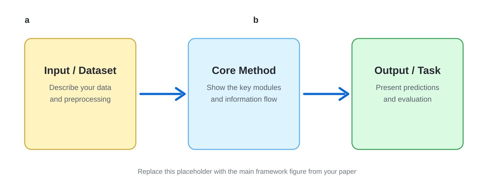
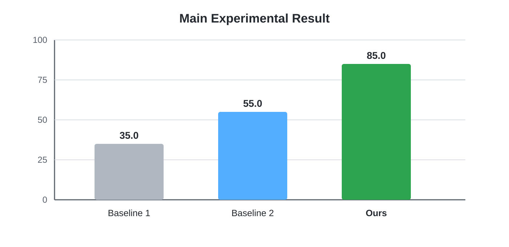

# Your Paper Title

<!-- Replace the logo, project name, paper title, and links below. -->

<div align="center">
  
  <h2>Project Name</h2>
  <p>
    The official implementation of <strong>"Your Full Paper Title"</strong>.
  </p>
  <p>
    <a href="#"><strong>Paper</strong></a> |
    <a href="#"><strong>arXiv</strong></a> |
    <a href="#"><strong>Code</strong></a> |
    <a href="#"><strong>Demo</strong></a> |
    <a href="#"><strong>Dataset</strong></a>
  </p>
</div>

<!-- Delete links that your project does not need. -->

**Models:** [Model-S](#) · [Model-B](#) · [Model-L](#)

**Datasets:** [Dataset-A](#) · [Dataset-B](#)

## Introduction

<!-- Replace this paragraph with a concise summary of the research problem and method. -->

We present **Project Name**, a method designed to solve **[research problem]**. Our approach combines **[core component A]** and **[core component B]** to improve **[target capability or metric]**. The main contributions are:

1. **Method.** We propose [one sentence describing the central technical contribution].
2. **Dataset or benchmark.** We introduce [dataset/benchmark name and its most important property].
3. **Results.** Our method achieves [main numerical result] on [dataset/task], outperforming [baseline] by [improvement].

<p align="center">
  
</p>

<p align="center"><em>Figure 1. Overview of the proposed method. Replace this image with your framework figure.</em></p>

## Highlights

- **Strong performance:** [Describe the most important quantitative result.]
- **Generalization:** [Describe results across datasets, languages, domains, or settings.]
- **Open resources:** [List the code, model, dataset, or benchmark being released.]

## Main Results

<!-- Replace the placeholder image and preserve the relative path. -->

<p align="center">
  
</p>

<p align="center"><em>Figure 2. Main experimental results. Higher is better.</em></p>

| Method | Dataset A | Dataset B | Average |
|:--|--:|--:|--:|
| Baseline 1 | 00.0 | 00.0 | 00.0 |
| Baseline 2 | 00.0 | 00.0 | 00.0 |
| **Ours** | **00.0** | **00.0** | **00.0** |

## Installation

```bash
git clone https://github.com/USERNAME/REPOSITORY.git
cd REPOSITORY
pip install -r requirements.txt
```

## Usage

```bash
# Replace this command with the actual training or inference command.
python main.py --config configs/default.yaml
```

## Citation

If you find this work useful, please cite:

```bibtex
@article{yourkey2026,
  title   = {Your Full Paper Title},
  author  = {First Author and Second Author and Others},
  journal = {Conference or Journal Name},
  year    = {2026}
}
```

## Acknowledgements

This project builds upon [Project or Dataset Name](https://github.com/). We thank the authors for making their work publicly available.

